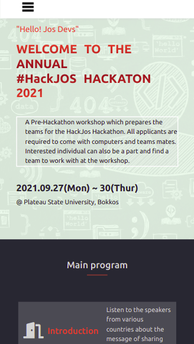
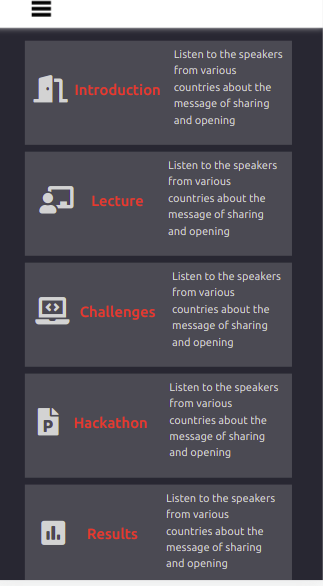
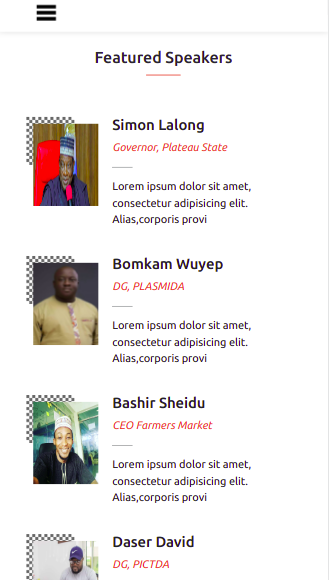
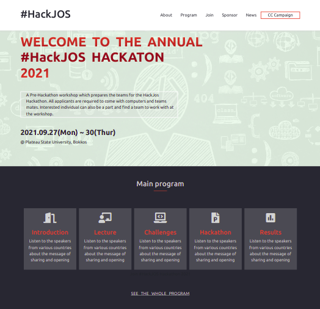
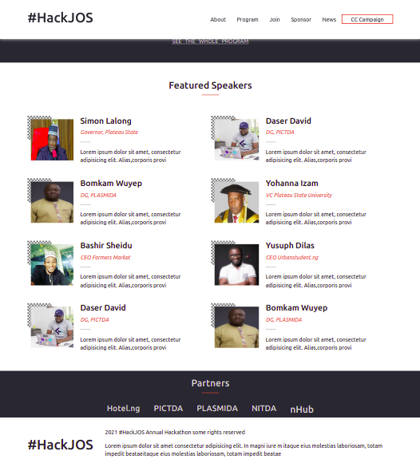

# #HackJOS Hackathon

The #HackJos hackathon, the first hackathon in northern Nigeria, held on the 23rd and the 24th of March in the city of Jos, is an annual Hackathon aimed at descovering great talents in software development.

## Screenshots

<br>

<br>

<br>

<br>



## Built With

- HTML
- CSS
- JavaScript

## Demo

https://wuyepabdul.github.io/jos-dev-hackathon/

## Getting Started

Clone the project

```bash
  git clone https://github.com/wuyepabdul/jos-dev-hackathon
```

Go to the project directory

```bash
  cd jos-dev-hackathon
```

Run the project

```bash
  Right click and choose Open file in browser or live server

```

## Authors

- GitHub:[@Wuyep Abdul](https://www.github.com/wuyepabdul)

## Acknowledgments

- Original design idea by Cindy Shin in Behance

## License

This project is [MIT](https://choosealicense.com/licenses/mit/) licensed
